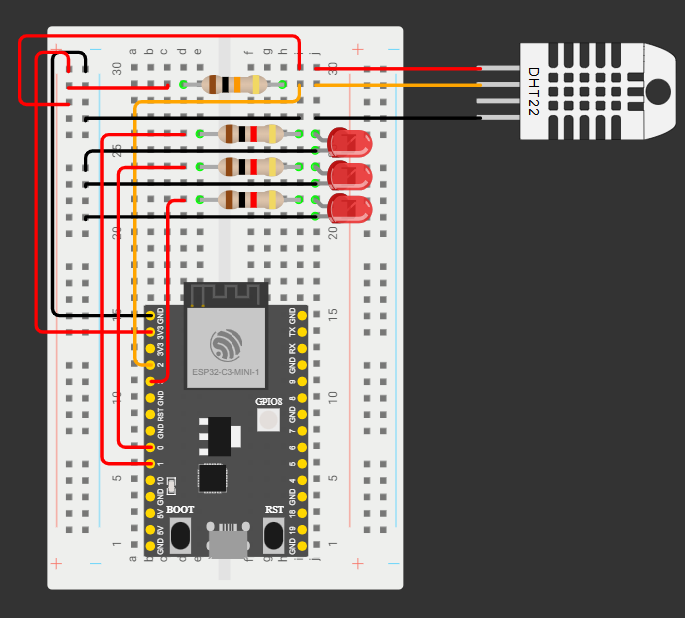

# 🌡️ ESP32 Climate Bridge

Código feito em C++ para um dispositivo ESP32 com sensor DHT22 (temperatura e umidade) que envia dados via MQTT para estudo e analise. Este código faz parte do projeto SenseTrack.

---

## ⚙️ Funcionalidades

- Leitura de temperatura e umidade com DHT22
- Conexão Wi-Fi automática
- Envio via MQTT para o Home Assistant
- Tópicos MQTT personalizáveis
- Integração com **Home Assistant (via MQTT ou HTTP)**
- Fácil integração com backend externo

---

## 🛠️ Instalação

### 1. Clonar este repositório

```bash
git clone https://github.com/SViniQ/esp32_climate_bridge.git
```

### 2. Abrir o código em um editor de código

- VS Code com a extensão PlatformIO IDE
- Arduino IDE

### 3. Fazer upload do Código na placa ESP32

### 4. Analisar no console se o sensor e a placa ESP32 estão recebendo os cados

---

## 🔌 Esquema de ligação da parte física

Para que o sensor DHT22 funcione corretamente com o ESP32-C3, siga o esquema de ligação abaixo.  
É obrigatório o uso de um **resistor de 10kΩ entre o pino VCC e o pino DATA**.

### 🖼️ Esquema visual:



> 💡 *Imagem baseada no modelo DHT22 sem placa integrada. Se o seu sensor for “cru”, conecte o resistor de 10kΩ manualmente.*

### 📋 Pinos utilizados:

| DHT22 (4 pinos) | ESP32-C3 | Função                     |
|------------------|------------|----------------------------|
| 1 – VCC          | 3V3        | Alimentação                |
| 2 – DATA         | GPIO2      | Comunicação (com resistor) |
| 3 – NC           | -          | Não conectado              |
| 4 – GND          | GND        | Terra                      |

---

## 💻 Como usar

1. Faça o upload do código via Arduino IDE
2. Instale a biblioteca `DHT sensor library` (by Adafruit)
3. Verifique o monitor serial (9600 baud)
4. Integre com Home Assistant (MQTT ou REST)

---
## 👨🏽‍💻 Feito por:

- Vinícius S. Queiroz - [Link do LinkedIn](https://www.linkedin.com/in/viníciussilvaqueiroz/)

## 🤝 Novas Contribuições?

Sinta-se à vontade para abrir *Issues* ou *Pull Requests*.  
Vamos construir isso juntos e expandir esse projeto!

# 🌡️ ESP32 Climate Bridge

C++ code for an ESP32 device with a DHT22 sensor (temperature and humidity) that sends data via MQTT for study and analysis. This code is part of the SenseTrack project.

---

## ⚙️ Features

- Temperature and humidity reading with DHT22
- Automatic Wi-Fi connection
- MQTT sending for Home Assistant
- Customizable MQTT topics
- Integration with **Home Assistant (via MQTT or HTTP)**
- Easy integration with external backend

---

## 🛠️ Installation

### 1. Clone this repository

```bash
git clone https://github.com/SViniQ/esp32_climate_bridge.git
```

### 2. Open the code in a code editor

- VS Code with the PlatformIO IDE extension
- Arduino IDE

### 3. Upload the code to the ESP32 board

### 4. Check the console to see if the sensor and ESP32 board are receiving data

---

## 🔌 Physical wiring diagram

For the DHT22 sensor to work correctly with the ESP32-C3, follow the wiring diagram below.  
It is mandatory to use a **10kΩ resistor between the VCC pin and the DATA pin**.

### 🖼️ Visual diagram:


> 💡 *Image based on the DHT22 model without an integrated board. If your sensor is “bare”, connect the 10kΩ resistor manually.*

### 📋 Used pins:

| DHT22 (4 pins) | ESP32-C3 | Function                        |
|----------------|----------|---------------------------------|
| 1 – VCC        | 3V3      | Power supply                    |
| 2 – DATA       | GPIO2    | Communication (with resistor)   |
| 3 – NC         | -        | Not connected                   |
| 4 – GND        | GND      | Ground                          |

---

## 💻 How to use

1. Upload the code via Arduino IDE
2. Install the `DHT sensor library` (by Adafruit)
3. Check the serial monitor (9600 baud)
4. Integrate with Home Assistant (MQTT or REST)

---

## 👨🏽‍💻 Made by:

- Vinícius S. Queiroz - [LinkedIn link](https://www.linkedin.com/in/viníciussilvaqueiroz/)

## 🤝 New Contributions?

Feel free to open *Issues* or *Pull Requests*.  
Let's build this together and expand this project!
